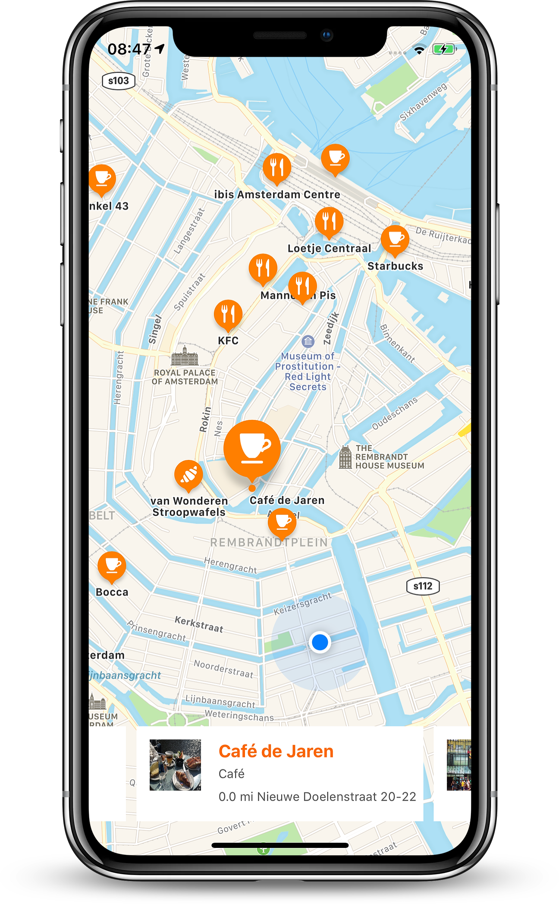
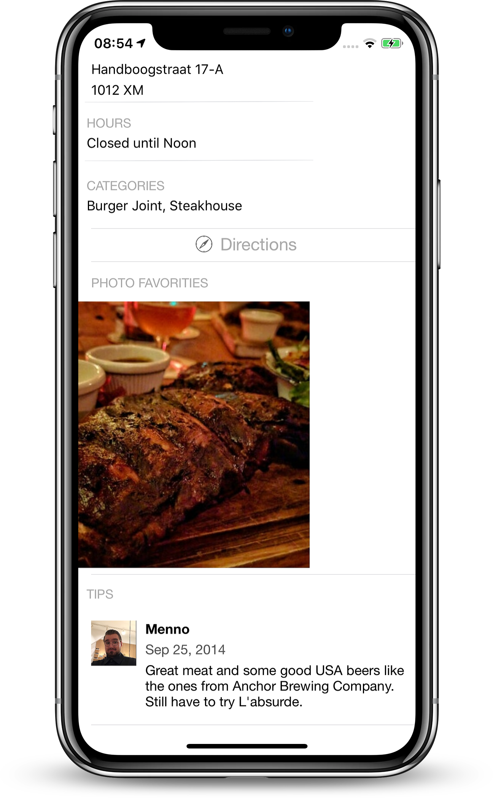
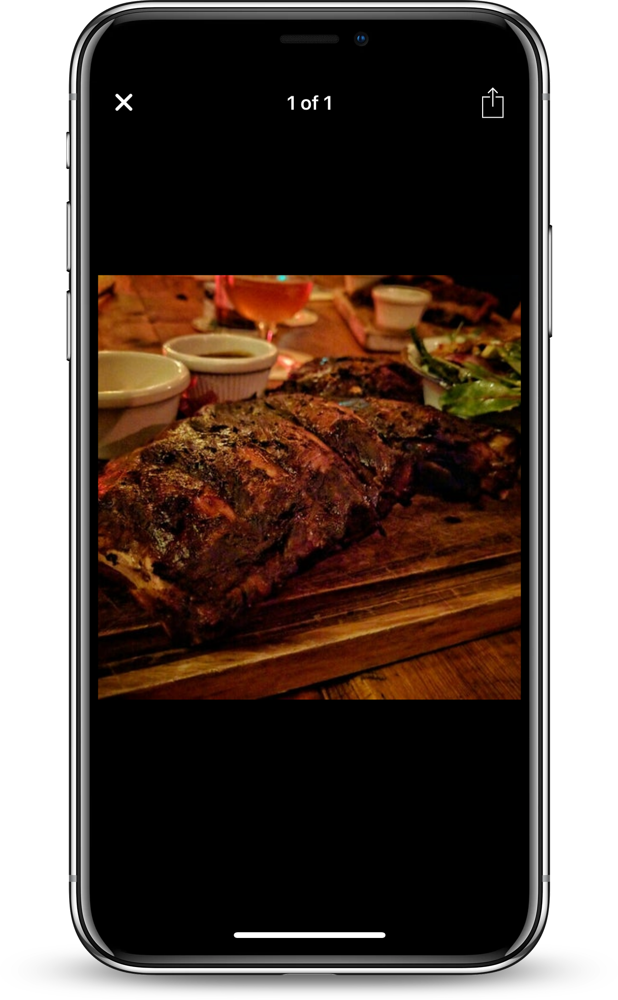
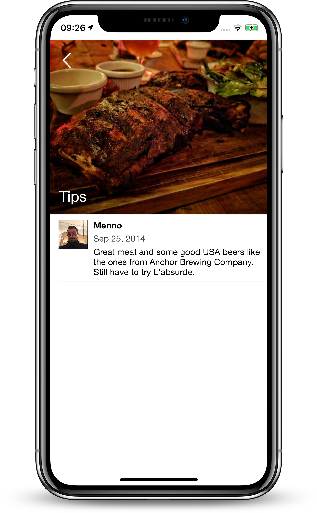
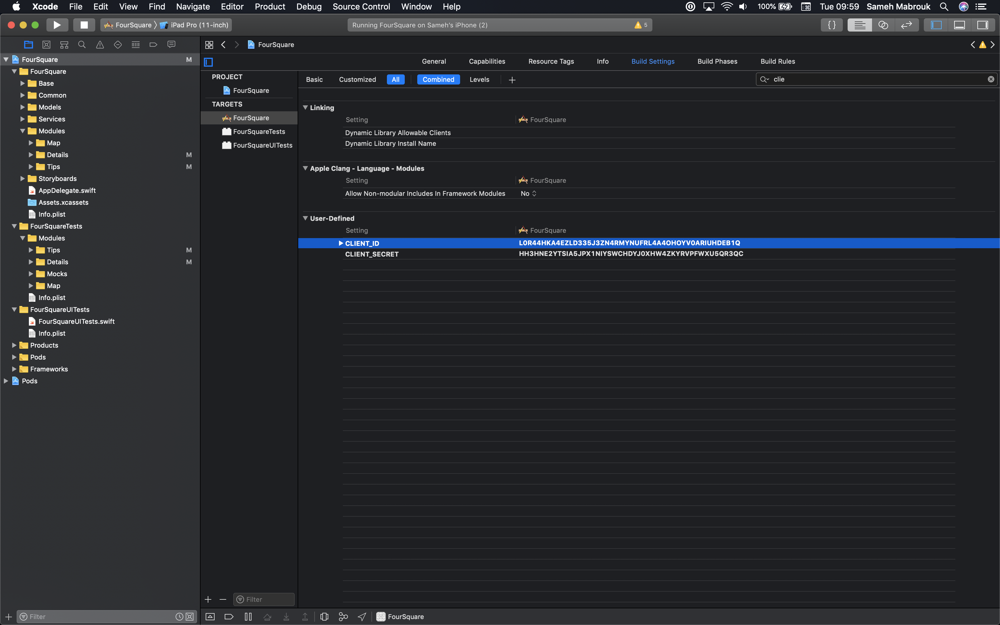
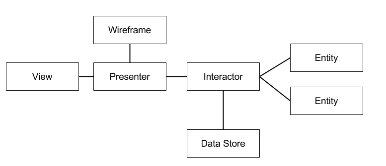

# Foursquare
========================

[](https://developer.apple.com/iphone/index.action)
[](https://developer.apple.com/swift)
[](http://mit-license.org)

## Overview
iOS Foursquare client that display the restaurants around your current location on the
map. Developed using Swift, VIPER and TDD.







## App Description

Using this application, a user should be able to see the restaurant around his/her current location. The data is available by connecting to the Foursquare API https://developer.foursquare.com/.

**App use cases**

*Map*:

- In this screen, the app shows a map with restaurant aroud a user's current location. this screen has a handy collection view that contain all the venues/restaurants, each item in the collection view has a name, image, venue category and distance to that venue. user can press that item to go to venue details screen. if a user swipe the collection view horizontally the app will select the specific annotation for the venue on the map and it works the other way around, if a user select a venue annotation form the map the collection view will scroll to that specific item/venue. 

*Details*:

- When tapping an item from map screen, user should be able to see deetails screen that has some informations about the selected venue. it has a beautiful UItableView steaky header/Parralax view and some details like venue rating, address, photos, tips. 
Note: due to Foursquare API rate limiting based on the account type which is free in this case we only get 1 tip, and no details like usersCount,checkinsCount and visitsCount wo some details will be missing in the Rating cell. 

*Tips*:

- When tapping an item from tips list, user should see tips screen presented with a beautifl animation like the App store app transitions. each tip has a user name, photo, created date and text. this tips screen also has a steacky/parallax view for UITableView.

## Installation

Just clone the repo or download it in zip-file, Open the project in Xcode then test it on your iOS device or iOS simulator.

In case you want to change the project setup like Foursquare API keys:

* Get your own keys from https://developer.foursquare.com/docs/api
* Change CLIENT_ID, CLIENT_SECRET user defined keys in the project's build settings as shown below:



# Xcode Project files structure
```bash
.swift
+-- Common
|   +-- Extensions
    |   +-- UINavigationController+NavigationControlling.swift
|   +-- Components
    |   +-- Photo Gallery
+-- AppDelegate
|   +-- AppDelegate.swift
+-- Storyboards
|   +-- Main.storyboard
|   +-- LaunchScreen.storyboard
+-- Models
|   +-- Venue.swift
|   +-- Photo.swift
+-- Assets
|   +-- Assets.xcassets
+-- Base
|   +-- Networking
+-- Modules
|   +-- Map
    |   +-- Interactor
        |   +-- MapInteractor.swift
        |   +-- MapInteracting.swift
    |   +-- Presenter
            |   +-- ListPresenter.swift
            |   +-- MapPresenting.swift
    |   +-- View
            |   +-- MapViewable.swift
            |   +-- MapViewController.swift
    |   +-- Router
            |   +-- MapRoutable.swift
            |   +-- MapRouter.swift
|   +-- Details
|   +-- Tips
         
.swift tests
+-- Modules
|   +-- Map
    |   +-- MapInteractorTests.swift
    |   +-- MapPresenterTests.swift
    |   +-- MapRouterTests.swift    
|   +-- Details
    |   +-- DetailsRouterTests.swift
    |   +-- DetailsPresenterTests.swift
    |   +-- DetailsInteractorTests.swift    
|   +-- Tips
    |   +-- TipsRouterTests.swift
    |   +-- DetailsPresenterTests.swift
    |   +-- TipsPresenterTests.swift    
```


# Design Patterns used:

# VIPER Architecture design pattern:

**What is VIPER?**
VIPER is an application of Clean Architecture to iOS apps. The word VIPER is a backronym for View, Interactor, Presenter, Entity, and Routing. Clean Architecture divides an app’s logical structure into distinct layers of responsibility. This makes it easier to isolate dependencies (e.g. your database) and to test the interactions at the boundaries between layers:


- Know more about VIPER through this post http://www.objc.io/issue-13/viper.html

**Why VIPER**:

*Smaller files*:

- VIPER (without a few exceptions:) ) has very clear politics about responsibility for each component. It helps with reducing amount of code in files and putting into the right place according to a single responsibility principle. 

*Better code coverage*: 

- Smaller classes mean smaller test cases as well. Tests resort less to exotic tricks and are simpler to read. The barrier to entry to write unit tests is lower, so more developers write them. 

*Good for unit testing*:

- On the basis of VIPER principles, everything in one module is very well separated, so it creates good environment for unit testing. Look at [this](http://iosunittesting.com/tdd-with-viper/?utm_source=swifting.io) article regarding more info about TDD in VIPER.

**VIPER modules Generators** : 

If you really want to make your application based on VIPER architecture, do not even think to make it all manually. It will be a disaster! You need an automated process to create a new module.

By the way I've created an opens source tool that automate the process of generating VIPER modules. A simple OS X App for generating VIPER modules's skeleton to use them in your Objective-C/Swift projects.
You can download it now:

* [ViperCode](https://github.com/iSame7/ViperCode)
* [VIPER-Module](https://github.com/iSame7/VIPER-Module)

# Dependency Injection:

Use of VIPER architecture gives great possibility to apply dependency injection. For example, let’s consider an example of a presenter:

```swift
class MapPresenter: MapPresenting {
    private weak var view: MapViewable?
    private let mapInteractor: MapInteracting
    private let router: MapRoutable
    
    init(view: MapViewable?, mapInteractor: MapInteracting, router: MapRoutable) {
        self.view = view
        self.mapInteractor = mapInteractor
        self.router = router
    }
    
    func viewDidLoad() {
        mapInteractor.determineUserLocation { [weak self] location in
            self?.view?.updateUserLocation(MapViewController.LocationViewModel(lat: location.lat, lng: location.lng))
        }
    }
    
    func getRestaurantsAround(coordinate: String) {
        mapInteractor.getRestaurantsAround(coordinate: coordinate) { [weak self] (venues, error) in
            if let venues = venues {
                self?.view?.update(venues)
            } else if let error = error {
                self?.view?.showError(error: error)
            }
        }
    }
    
    func getPhotos(venueId: String) {
        mapInteractor.getVenuePhotos(venueId: venueId) { [weak self] photos in
            print("Photos: \(photos)")
            if !photos.isEmpty {
                let photo = "\(photos[0].prefix)700x500\(photos[0].suffix)"
                self?.view?.update(with: photo, for: venueId)
            }

        }
    }
    
    func showDetailsViewController(venue: Venue, venuePhotoURL: String?) {
        guard let vmapViewController = view as? UIViewController else { return }
        
        router.navigateToDetailsModule(navController: vmapViewController.navigationController, venue: venue, venuePhotoURL: venuePhotoURL)
    }
}
```

Injection in this class gave us two advantages:

* We have a better sense what’s going on in this code. We see immediately what dependencies our class has
* On the other hand, our class is prepared for unit testing

*When using VIPER architecture a good practice is to use DI in every component. i will show in Unit Test section a few examples how this approach can really help us during testing.


# Unit testing:

I started from testing interactor and presenter, because interactor contains main business logic and presenter contains logic responsible for preparing data before displaying. These components seems more critical than others.

Libraries/Frameworks i used for unit tests and TDD:

* XCTest


In VIPER every component of a module is strictly separated what creates a very friendly scenario for adopting unit tests in terms of single responsibility principle:

let’s consider an example of a presenter of List Characters Module:

by separating components in our test we can focus only on testing responsibility of interactor. The others components which talk with interactor are just mocked.

How does it look like in perspective of code?

```swift
class MapPresenterTests: XCTestCase {
    // MARK: - Test variables
    private let mockMapViewController = MockMapViewController()
    private let mockMapInteractor = MockMapInteractor()
    private let mockDetailsModuleBuilder = MockDetailsBuilder()
    private let mockNavigationController = MockNavigationController()
    private var mockRouter = MockRouter()
    private var sut: MapPresenter?
    
    private let mockVenue = Venue(id: "123", name: "Restaurant A", contact: nil, location: Location(lat: 52.36795609763071, lng: 4.895555168247901, address: "Nieuwe Doelenstraat 20-22", crossStreet: nil, distance: nil, postalCode: "1012 CP", cc: nil, city: "Amsterdam", state: "North Holland", country: "Netherlands"), categories: [Category(id: "4bf58dd8d48988d16d941735", name: "Café", pluralName: "Cafés", shortName: "Café", icon: Category.Icon(prefix: "https://ss3.4sqi.net/img/categories_v2/food/cafe_", suffix: ".png"), primary: nil)], verified: false, url: nil, stats: nil, likes: nil, rating: nil, hours: nil, photos: nil, tips: nil)
    
    // MARK: - Test life cycle
    override func setUp() {
        sut = MapPresenter(view: mockMapViewController, mapInteractor: mockMapInteractor, router: mockRouter)
    }
    
    // MARK: - Tests
    func testIsMapViewLoaded() {
        sut?.viewDidLoad()
        
        XCTAssertNotNil(mockMapViewController.locationViewModel)
        XCTAssertEqual(mockMapViewController.locationViewModel.lat, 52.36795609763071)
        XCTAssertEqual(mockMapViewController.locationViewModel.lng, 4.895555168247901)
    }
    
    func testGetRestaurantsArountCoordinate() {
        sut?.getRestaurantsAround(coordinate: "52.362305405787325,4.8999109843211")
        XCTAssertNotNil(mockMapViewController.venues)
        XCTAssertEqual(mockMapViewController.venues.count, 2)
        XCTAssertEqual(mockMapViewController.venues.first?.name, "Restaurant A")
        XCTAssertEqual(mockMapViewController.venues.first?.location.lat, 52.36795609763071)
        XCTAssertEqual(mockMapViewController.venues.first?.location.lng, 4.895555168247901)
        XCTAssertEqual(mockMapViewController.venues.first?.location.address, "Nieuwe Doelenstraat 20-22")
        XCTAssertEqual(mockMapViewController.venues[1].name, "Starbucks")
        XCTAssertEqual(mockMapViewController.venues[1].location.lat, 52.36607678472145)
        XCTAssertEqual(mockMapViewController.venues[1].location.lng, 4.897430803910262)
        XCTAssertEqual(mockMapViewController.venues[1].location.address, "Utrechtsestraat 9")
    }
    
    func testGetRestaurantsAroundCoordinateWithError() {
        sut?.getRestaurantsAround(coordinate: "")
        
        XCTAssertNotNil(mockMapViewController.error)
        XCTAssertEqual(mockMapViewController.error, .noResponse)
    }
    
    func testGetPhotosForVenue() {
        sut?.getPhotos(venueId: "4f019124a69d45461f2458e7")
        
        XCTAssertNotNil(mockMapViewController.venuePhotoURL)
        XCTAssertNotNil(mockMapViewController.venueId)
        
        XCTAssertEqual(mockMapViewController.venuePhotoURL, "https://fastly.4sqi.net/img/general/700x500/WfIypTz_PxPvh75QSIBwomCu-jK_72UDiBauHc6L1dU.jpg")
    }
    
    func testIsDetailsModulePushedInNavigationController() {
        sut?.showDetailsViewController(venue: mockVenue, venuePhotoURL: "")
        
        XCTAssertTrue(mockRouter.didGoToDetailsModule)
    }
}

private class MockMapViewController: UIViewController, MapViewable {
    var locationViewModel: MapViewController.LocationViewModel!
    var venues: [Venue]!
    var error: FoursquareError!
    var venuePhotoURL: String!
    var venueId: String!
    
    func update(_ model: [Venue]) {
        venues = model
    }
    
    func showError(error: FoursquareError) {
        self.error = error
    }
    
    func update(with photo: String, for venueId: String) {
        venuePhotoURL = photo
        self.venueId = venueId
    }
    
    func updateUserLocation(_ locationViewModel: MapViewController.LocationViewModel) {
        self.locationViewModel = locationViewModel
    }
}

private class MockMapInteractor: MapInteracting {
    func getRestaurantsAround(coordinate: String, completion: @escaping ([Venue]?, FoursquareError?) -> Void) {
        if !coordinate.isEmpty {
            let mockVenue1 = Venue(id: "123", name: "Restaurant A", contact: nil, location: Location(lat: 52.36795609763071, lng: 4.895555168247901, address: "Nieuwe Doelenstraat 20-22", crossStreet: nil, distance: nil, postalCode: "1012 CP", cc: nil, city: "Amsterdam", state: "North Holland", country: "Netherlands"), categories: [Category(id: "4bf58dd8d48988d16d941735", name: "Café", pluralName: "Cafés", shortName: "Café", icon: Category.Icon(prefix: "https://fastly.4sqi.net/img/general/", suffix: "/WfIypTz_PxPvh75QSIBwomCu-jK_72UDiBauHc6L1dU.jpg"), primary: nil)], verified: false, url: nil, stats: nil, likes: nil, rating: nil, hours: nil, photos: nil, tips: nil)
            
            let mockVenue2 = Venue(id: "4f019124a69d45461f2458e7", name: "Starbucks", contact: nil, location: Location(lat: 52.36607678472145, lng: 4.897430803910262, address: "Utrechtsestraat 9", crossStreet: nil, distance: nil, postalCode: "1017 CV", cc: nil, city: "Amsterdam", state: "North Holland", country: "Netherlands"), categories: [Category(id: "4bf58dd8d48988d16d941735", name: "Coffee Shops", pluralName: "Coffee Shops", shortName: "Coffee Shops", icon: Category.Icon(prefix: "https://ss3.4sqi.net/img/categories_v2/food/coffeeshop_", suffix: ".png"), primary: nil)], verified: false, url: nil, stats: nil, likes: nil, rating: nil, hours: nil, photos: nil, tips: nil)
            completion([mockVenue1, mockVenue2], nil)
        } else {
            completion(nil, .noResponse)
        }
    }
    
    func getVenuePhotos(venueId: String, completion: @escaping ([Photo]) -> Void) {
        let photo1 = Photo(id: "4fe03279e4b0690a86767319", prefix: "https://fastly.4sqi.net/img/general/", suffix: "/WfIypTz_PxPvh75QSIBwomCu-jK_72UDiBauHc6L1dU.jpg", width: 720, height: 540, visibility: "public", source: Source(name: "Foursquare for iOS", url: "https://foursquare.com/download/#/iphone"))
        let photo2 = Photo(id: "51dbe1e9498e361de7fccbb7", prefix: "https://fastly.4sqi.net/img/general/", suffix: "/9664729_cr9GMPE2yxpPO_e4CFx5xtyNdjWqNQa06SZBO3aFbio.jpg", width: 720, height: 720, visibility: "public", source: Source(name: "Foursquare for iOS", url: "https://foursquare.com/download/#/iphone"))
        completion([photo1, photo2])
    }
    
    func determineUserLocation(completion: @escaping UserLocationBlock) {
        completion(Location(lat: 52.36795609763071, lng: 4.895555168247901, address: "Nieuwe Doelenstraat 20-22", crossStreet: nil, distance: nil, postalCode: nil, cc: nil, city: nil, state: nil, country: nil))
    }
}

private class MockRouter: MapRoutable {
    var didGoToDetailsModule = false
    func navigateToDetailsModule(navController: NavigationControlling?, venue: Venue, venuePhotoURL: String?) {
        didGoToDetailsModule = true
    }
}
```
